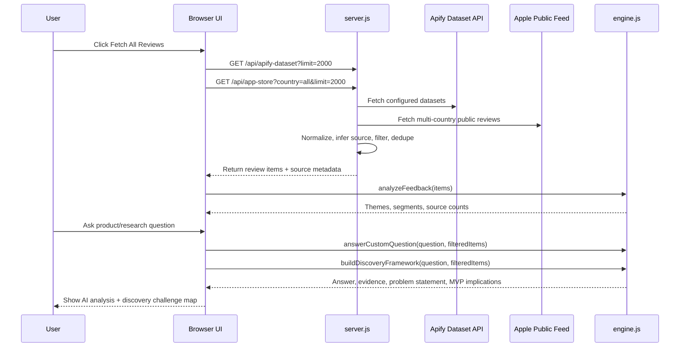

# AI Review Discovery Engine Architecture

## System Diagram

```mermaid
flowchart LR
  subgraph Sources["Review Sources"]
    A1["Apple App Store<br/>Public review feed"]
    A2["Apify datasets<br/>App Store, Play Store, Reddit, Twitter/X"]
    A3["Optional Reddit endpoint<br/>OAuth or public search"]
  end

  subgraph Server["Node Server"]
    S1["server.js<br/>HTTP API + static UI"]
    S2["app-store-client.js<br/>Apple feed fetcher"]
    S3["apify-client.js<br/>Apify dataset importer"]
    S4["reddit-client.js<br/>Optional Reddit importer"]
    S5["load-env.js<br/>Local env loader"]
  end

  subgraph Normalize["Normalization + Filtering"]
    N1["Source inference<br/>app_store / play_store / reddit / social"]
    N2["Review normalization<br/>text, rating, date, author, metadata"]
    N3["Spotify relevance filter<br/>social evidence must mention Spotify context"]
    N4["Deduplication + sorting<br/>latest usable reviews"]
  end

  subgraph Intelligence["Analysis Engine"]
    E1["engine.js<br/>theme classification"]
    E2["Behavioral segmentation<br/>comfort, mood, passive discovery"]
    E3["Question retrieval<br/>term expansion + evidence scoring"]
    E4["Discovery framework<br/>problem statement, root cause, MVP implication"]
  end

  subgraph UI["Browser UI"]
    U1["Data pipeline counts"]
    U2["Ask AI question"]
    U3["Discovery challenge map"]
    U4["Source evidence quotes"]
    U5["Source filters + search"]
  end

  subgraph MVP["Next MVP Input"]
    M1["Target segment"]
    M2["Problem statement"]
    M3["Root cause"]
    M4["AI-native MVP rules"]
    M5["Evidence-backed quotes"]
  end

  A1 --> S2
  A2 --> S3
  A3 --> S4
  S2 --> S1
  S3 --> S1
  S4 --> S1
  S5 --> S1
  S1 --> N1 --> N2 --> N3 --> N4 --> E1
  E1 --> E2 --> E3 --> E4
  E1 --> U1
  E3 --> U2
  E4 --> U3
  E3 --> U4
  U5 --> E3
  U3 --> MVP
  U4 --> MVP
  MVP --> M1
  MVP --> M2
  MVP --> M3
  MVP --> M4
  MVP --> M5
```



## Request Flow



## Layer Responsibilities

| Layer | Responsibility | Key files |
| --- | --- | --- |
| Sources | Provide raw user feedback from stores and social discussion surfaces. | Apify, Apple feed, optional Reddit |
| Server API | Serves the UI and exposes ingestion endpoints. | `server.js` |
| Import clients | Fetch raw data from external sources. | `src/apify-client.js`, `src/app-store-client.js`, `src/reddit-client.js` |
| Normalization | Converts source-specific rows into one feedback-item shape. | `src/apify-client.js`, `src/app-store-client.js` |
| Analysis engine | Converts feedback into themes, segments, answers, and MVP-ready problem framing. | `src/engine.js` |
| UI | Lets the PM fetch reviews, ask questions, inspect evidence, and read the discovery framework. | `web/index.html`, `web/app.js`, `web/styles.css` |
| MVP handoff | Turns research evidence into target segment, problem statement, root cause, and MVP rules. | Discovery challenge map |

## Data Contract

Every imported review is normalized into this working shape:

```json
{
  "id": "source-specific-id",
  "source": "app_store | play_store | reddit | social",
  "text": "review or post text",
  "rating": 1,
  "url": "source URL when available",
  "createdAt": "2026-06-26",
  "metadata": {
    "provider": "apify",
    "datasetId": "dataset_id",
    "country": "us",
    "author": "reviewer",
    "version": "app version",
    "raw": {}
  }
}
```

The engine enriches this into:

```json
{
  "themeLabel": "Repetitive Recommendations",
  "segment": "Comfort Loopers with Discovery Intent",
  "painPoint": "Recommendations feel stale or recycled.",
  "userIntent": "Discover fresh music without losing familiar taste.",
  "mvpRule": "Penalize recently repeated artists and require a minimum new-artist ratio.",
  "sentiment": "frustrated",
  "evidenceQuote": "source quote"
}
```

## Why This Is AI-Native

The core value is not only collecting reviews. The engine converts unstructured review text into a reusable product decision layer:

- It retrieves evidence based on a PM’s question.
- It reframes evidence into a problem statement.
- It identifies the likely segment and root cause.
- It produces MVP implications from review patterns.
- It keeps source quotes available so the framing stays auditable.

